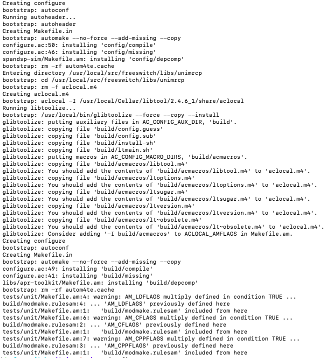
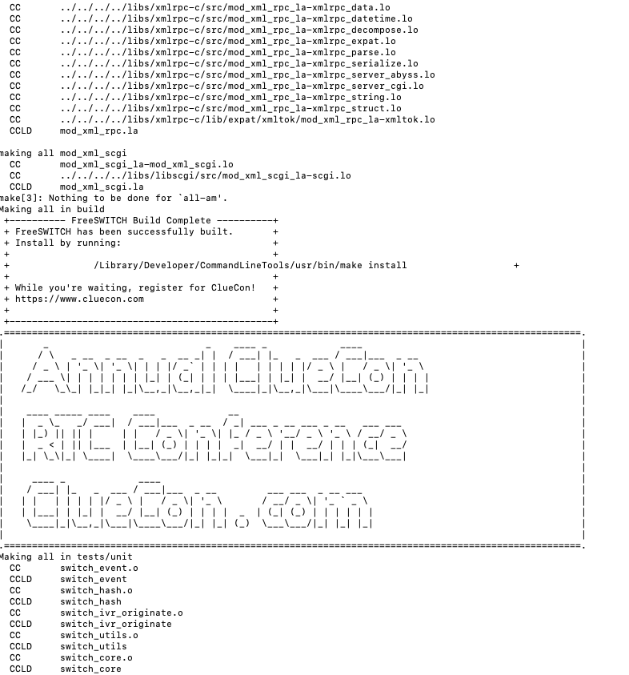
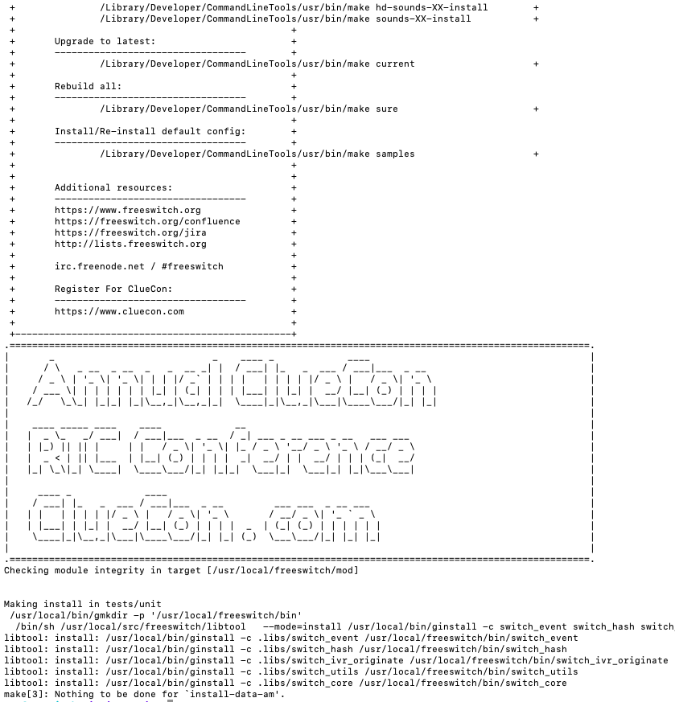

# Freeswitch sample configuration for various usecases

freeswitch internal architecture  

Opensource SIP Application Server
Mozilla Public License (MPL)

## Installation on debain / Ubuntu

Update the Package Manager.
```
apt-get update && apt-get install -y gnupg2 wget
```

Add the Public Key of FreeSwitch package to local Package Manager.
```
wget -O - https://files.freeswitch.org/repo/deb/debian-release/fsstretch-archive-keyring.asc | apt-key add -
```

Add the FreeSwitch repository URL to the source list of local Package Manager.
```
echo "deb http://files.freeswitch.org/repo/deb/debian-release/ stretch main" > /etc/apt/sources.list.d/freeswitch.list
echo "deb-src http://files.freeswitch.org/repo/deb/debian-release/ stretch main" >> /etc/apt/sources.list.d/freeswitch.list
```

Install the FreeSwitch package.
```
apt-get update && apt-get install -y freeswitch-meta-all 
```

## Installation on mac os 

make the folder structure 
```
cd /usr/local      
sudo mkdir freeswitch src  
sudo chown -R `id -u`:`id -g` freeswitch src
```
use home brew to install dependencies 
```
brew install autoconf automake curl ffmpeg jpeg ldns libpq libsndfile libtiff libtool lua openssl opus pcre pkg-config speex speexdsp sqlite yasm signalwire/homebrew-signalwire/flite signalwire/homebrew-signalwire/libks signalwire/homebrew-signalwire/signalwire-c
```

get the source code 
```
/usr/local/src
FSfile=$(curl -s https://files.freeswitch.org/freeswitch-releases/ | grep -oE "freeswitch-[0-9]*\.[0-9]*\.[0-9]*\.-release\.tar\.bz2" | tail -n 1) && echo Downloading $FSfile && curl https://files.freeswitch.org/freeswitch-releases/$FSfile | tar -xj && mv ${FSfile/.tar.bz2//} freeswitch
git clone https://stash.freeswitch.org/scm/fs/freeswitch.git
```

run bootstrap 
```
./bootstrap.sh
```
bootrap screen for fresswitch 

run configure
```
./configure
```
configure screen for fresswitch 

make text to soeech
```
perl -pi -e 's{#asr_tts/mod_flite}{asr_tts/mod_flite}' /usr/local/src/freeswitch/modules.conf
```

compile
```
make 
```
make screen for fresswitch 

install
```
make install 
```
install screen for fresswitch 

download and install sounds 
```
make cd-sounds-install cd-moh-install
```

remove tenporary files that are not required afetr make 
```
make clean
```

start freeswitch 
```
cd /usr/local/freeswitch/bin
./freeswitch
```
run screen for fresswitch 


## Command Line cli - fs_cli

Viewing preset freeswitch variables by fs_cli eval $${variable}.  Can view value of 
hostname
local_ip_v4
local_mask_v4
local_ip_v6
switch_serial
base_dir
recordings_dir
sound_prefix
sounds_dir
conf_dir
log_dir
run_dir
db_dir
mod_dir
htdocs_dir
script_dir
temp_dir
grammar_dir
certs_dir
storage_dir
cache_dir
core_uuid
zrtp_enabled
nat_public_addr
nat_private_addr
nat_type

## Sofia 
Sofia is a SIP stack used by FreeSWITCH.

Reload all xml
```sh
sofia profile external rescan reloadxml
```

recover calls that were up, after crashing (or other scenarios)
```sh
sofia recover
```

sofis status
```
sofia status profile internal
=================================================================================================
Name              internal
Domain Name       N/A
Auto-NAT          false
DBName            sofia_reg_internal
Pres Hosts        x.x.x.x,x.x.x.x
Dialplan          XML
Context           public
Challenge Realm   auto_from
RTP-IP            x.x.x.x
Ext-RTP-IP        y.y.y.y
SIP-IP            x.x.x.x
Ext-SIP-IP        y.y.y.y
URL               sip:mod_sofia@y.y.y.y:5060
BIND-URL          sip:mod_sofia@y.y.y.y:5060;maddr=x.x.x.x;transport=udp,tcp
WS-BIND-URL       sip:mod_sofia@x.x.x.x:5066;transport=ws
WSS-BIND-URL      sips:mod_sofia@x.x.x.x:7443;transport=wss
HOLD-MUSIC        local_stream://moh
OUTBOUND-PROXY    N/A
CODECS IN         PCMU,PCMA
CODECS OUT        PCMU,PCMA
TEL-EVENT         101
DTMF-MODE         rfc2833
CNG               13
SESSION-TO        0
MAX-DIALOG        0
NOMEDIA           false
LATE-NEG          true
PROXY-MEDIA       false
ZRTP-PASSTHRU     true
AGGRESSIVENAT     false
CALLS-IN          0
FAILED-CALLS-IN   0
CALLS-OUT         0
FAILED-CALLS-OUT  0
REGISTRATIONS     0
```

## debuging in dev mode 

Turn sip trace on on selected profile or global
```
>sofia profile internal siptrace on
Enabled sip debugging on internal
```

**tcpdump**

taking traffic dumps using tcpdump
tcpdump -h
tcpdump version 4.9.2
libpcap version 1.5.3
OpenSSL 1.0.1f 6 Jan 2014
Usage: tcpdump [-aAbdDefhHIJKlLnNOpqStuUvxX#] 
[ -B size ] 
[ -c count ]
[ -C file_size ] 
[ -E algo:secret ] 
[ -F file ] 
[ -G seconds ]
[ -i interface ] 
[ -j tstamptype ] 
[ -M secret ] 
[ --number ]
[ -Q in|out|inout ]
[ -r file ] 
[ -s snaplen ] 
[ --time-stamp-precision precision ]
[ --immediate-mode ] 
[ -T type ] 
[ --version ] 
[ -V file ]
[ -w file ] 
[ -W filecount ] 
[ -y datalinktype ] 
[ -z postrotate-command ]
[ -Z user ] 
[ expression ]
uauage 
```sh
tcpdump -s 0 udp port 5080 -w /home/ubuntu/fs_pbx1.pcap
```

**ref**
- https://freeswitch.org/confluence/display/FREESWITCH/macOS+Manual+Installation
- https://freeswitch.org/confluence/display/FREESWITCH/macOS+Testing+and+Diagnostics